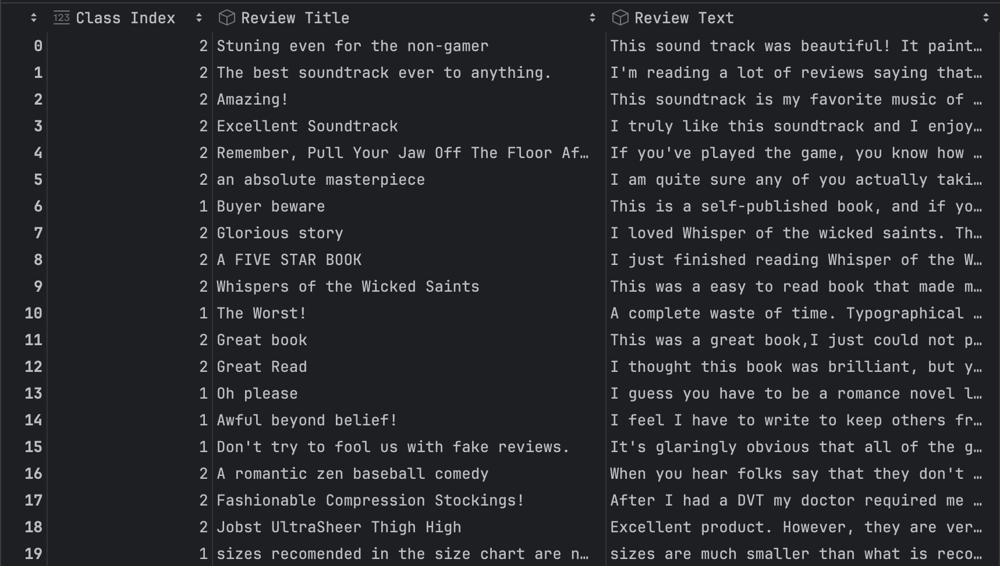
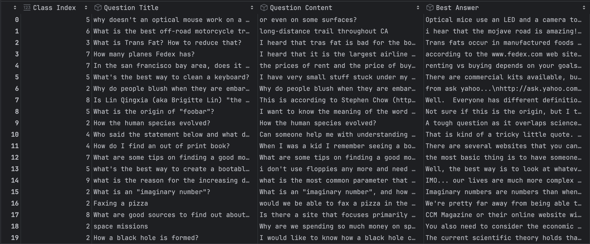

# Finetuning-BERT

## Thành viên trong nhóm
- Đồng Mạnh Hùng.
- Đoàn Quang Huy.
- Nguyễn Đình Khải. 

### Phân công nhiệm vụ
- Slide tham khảo: [BERT Finetuning](https://www.figma.com/slides/HVqfuP4ZpmdZO6IBifh2uc/Data-Science-Project---Recipe-Site-Traffic?node-id=1-305&t=kwlcwnsjv97iZGLf-1).
- Báo cáo: [Báo cáo](docs/report/Báo%20cáo.pdf)
- Code về hai phần liên quan đến BERT: Đồng Mạnh Hùng, Nguyễn Đình Khải.
- Tìm hiểu, thu thập và phân tích dữ liệu: Đoàn Quang Huy. 

## Nội dung chính

### Tóm tắt bài toán

Nghiên cứu sử dụng mô hình BERT - một mô hình Transformer 2 chiều - để tính toán độ chính xác
trong công tác dự đoán cảm xúc của người tiêu dùng trên nền tảng Amazon thông qua những lời bình luận 
và trong công tác dự đoán chủ đề của một câu hỏi trên diễn đàn Yahoo!, 
đồng thời thực hiện tinh chỉnh (Fine-tuning) để giúp BERT học thêm về ngữ cảnh và đặc thù của bài toán, từ đó cải thiện độ hiệu quả.

### Dữ liệu

Dữ liệu được thu thập và xây dựng bởi Xiang Zhang,
và từng được sử dụng trong nghiên cứu về Mạng Nơ-ron Tích Chập Cấp Độ Ký Tự cho Phân Loại Văn Bản, 
được công bố ở Hội thảo về Các hệ thống Nơ-ron xử lý thông tin (NIPS) năm 2015. 

#### Amazon Review Polarity

- Dữ liệu được xây dựng bằng việc lấy các đánh giá 1 sao và 2 sao là tiêu cực (label 1), 4 sao và 5 sao là tích cực (label 2). Các đánh giá 3 sao được lược bỏ. 
- Mỗi label sẽ có 1.8 triệu mẫu huấn luyện và 200,000 mẫu kiểm tra tương ứng. 
- Dữ liệu được lưu dưới dạng .csv và bao gồm 3 cột: Class Index (cột label), Review Title, Review Text.



#### Yahoo Answers

- Dữ liệu được xây dựng với việc sử dụng 10 chủ đề chính: Văn hóa và Xã hội; Khoa học và Toán học; Sức khỏe; Giáo dục và  Tham chiếu; Máy tính và Internet; Thể thao; Kinh doanh và Tài chính; Giải trí và Âm nhạc; Gia đình và các Mối quan hệ; Chính trị. 
- Mỗi chủ đề bao gồm 140,000 mẫu huấn luyện và 6,000 mẫu kiểm tra tương ứng. 
- Dữ liệu về câu trả lời: Chỉ lấy những câu trả lời hay nhất và bám sát với chủ đề. 
- Dữ liệu được lưu dưới dạng .csv và bao gồm 4 cột: Class Index (cột label), Question Title, Question Content, Best Answer. 


### Cách cài đặt và chạy ứng dụng demo

1. **Cài đặt thư viện cần thiết**  
- Mở terminal và chạy:
```bash
pip install torch streamlit transformers
```
2. **Chạy ứng dụng** 
- Mở terminal
- Di chuyển đến thư mục chứa mã nguồn, ví dụ nếu thư mục ở ổ C, trong folder Finetuning-BERT:
```bash
cd C:\Finetuning-BERT
```
- Chạy ứng dụng:
```bash
streamlit run demo.py
```
